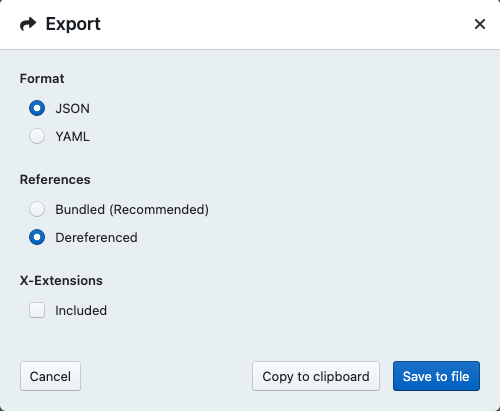

# Schemas

This directory contains the WIS2 Notification Message source schemas.  The schemas are managed
using JSON Schema (https://json-schema.org/draft/2020-12/schema) and represented
in YAML.

## Generating the JSON schema bundle

[Stoplight Studio](https://stoplight.io/studio) (free and open source) is a full GUI environment (web-based
or desktop) for designing schemas, models and APIs (JSON/YAML/OpenAPI).

To generate the WIS2 Notification Message JSON schema, following these steps:

- open Stoplight Studio
- click "Open Existing Folder"
- point to the `schemas/` directory
- ensure schema has no errors ("0 Issues" in the top right pane)
- click "Open"
- on the right hand pane, right-click the file `notificationMessageGeoJSON.yaml` and select "Export"
- select the following from the dialogue box:
  - Format: JSON
  - References: Dereferened
  - X-Extensions: unchecked
- click "Save to file"
- save file to `schemas/wis2-notification-message-bundled.json`
- commit changes

A screenshot is shown below:



Note: the above are manual steps to verify and generate the JSON Schema bundle.  Future updates will
include automated workflow via GitHub Actions.

## Validating a WIS2 Notification Message

```bash
# install the check-jsonschema Python package
pip3 install check-jsonschema

# validate a WIS2 Notification Message on the command line using JSON Schema
check-jsonschema --schemafile schemas/wis2-notification-message-bundled.json examples/example1.json

# validate a WIS2 Notification Message against the WNM ETS for full compliance
pywis-pubsub ets validate examples/example1.json
```
